# 🏦 Advanced Banking & Currency Management System

A robust, enterprise-grade **C++ Console Application** that simulates a full-scale banking environment integrated with a sophisticated currency exchange engine. 

---

## 🚀 Core Modules

### 1. 👤 User Management & Security
- **Multi-Level Permissions:** Bitwise system to control access to features.
- **Login/Logout Tracking:** Automatic logging of user sessions.
- **Full User CRUD:** Create, Read, Update, and Delete operators.

### 2. 💰 Banking Operations (Clients)
- **Account Management:** Profiles with unique account numbers and pin codes.
- **Transaction Engine:** Deposit, Withdraw, and Internal Transfers.
- **Transfer Auditing:** Logs saved in `TransferLog.txt` with timestamps.

### 3. 💱 Currency Exchange Engine
- **Global Database:** Manage world currencies and exchange rates.
- **Cross-Currency Calculator:** Convert any amount using **USD** as the base.

---

## 📸 System Showcase (Screenshots)

### 🔑 Authentication & Main Menu
| Login Screen | Home Menu | Access Denied |
| :---: | :---: | :---: |
| 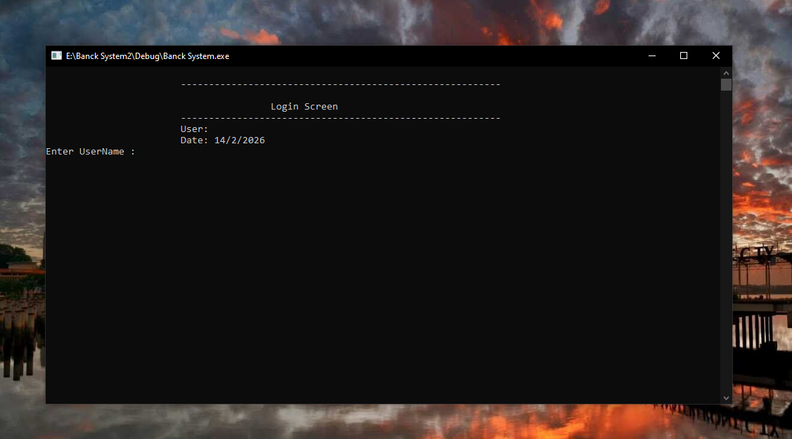 | 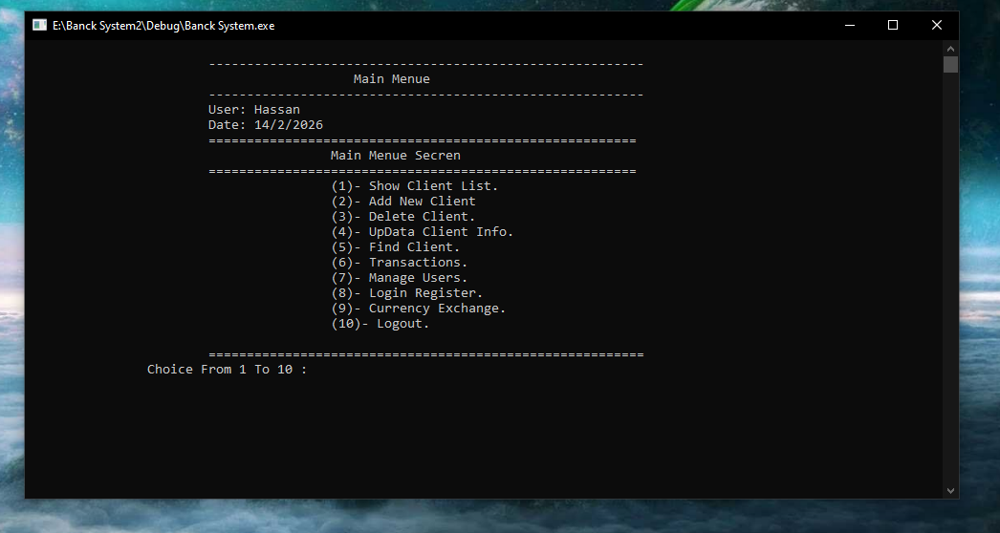 | 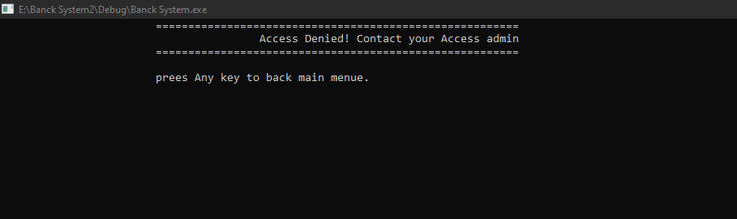 |

### 👥 Client & User Management
| Clients List | Add New User | Permissions System |
| :---: | :---: | :---: |
|  | 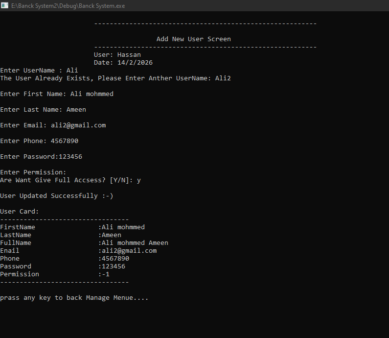 | 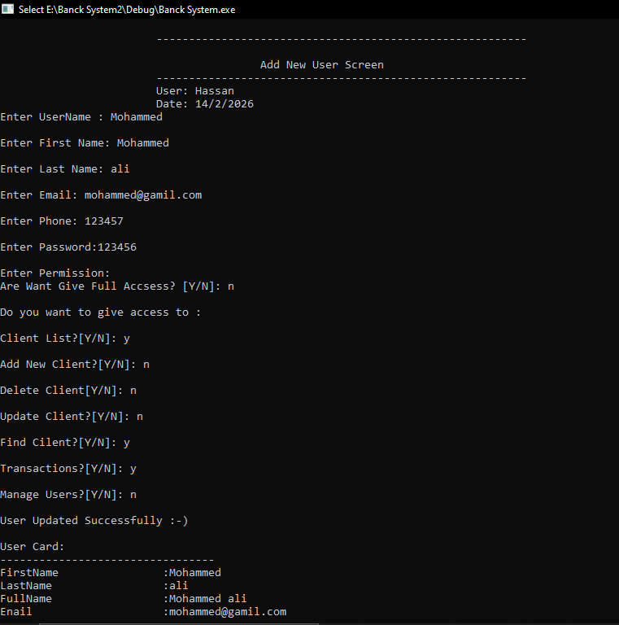 |

### 💸 Transactions & Transfers
| Transactions Menu | Transfer Operation | Transfer Log |
| :---: | :---: | :---: |
| 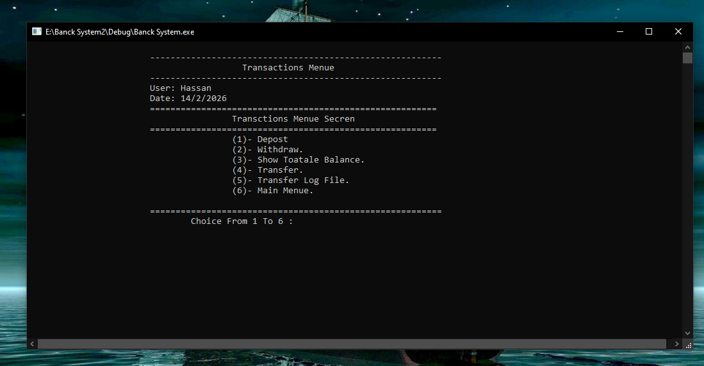 | 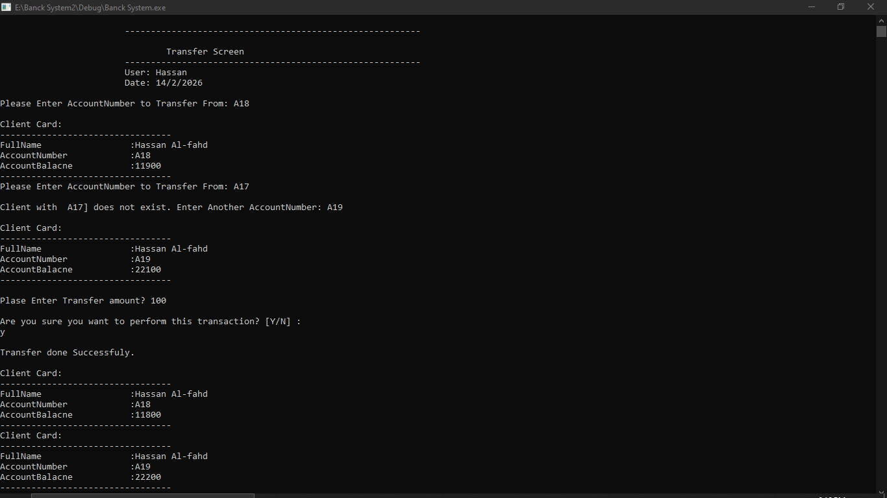 | 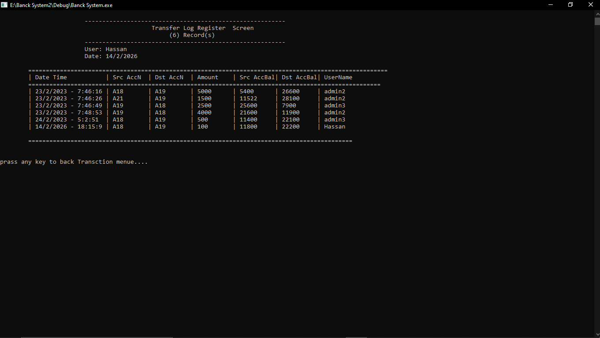 |

### 💱 Currency Exchange Module
| Currency Menu | Currency Calculator | Currencies List |
| :---: | :---: | :---: |
| 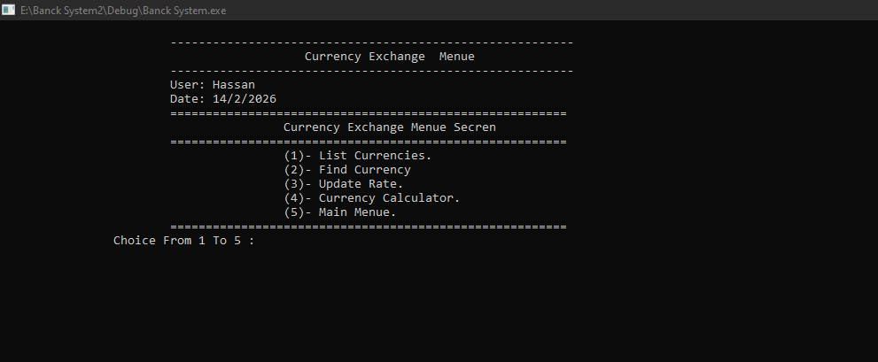 |  | 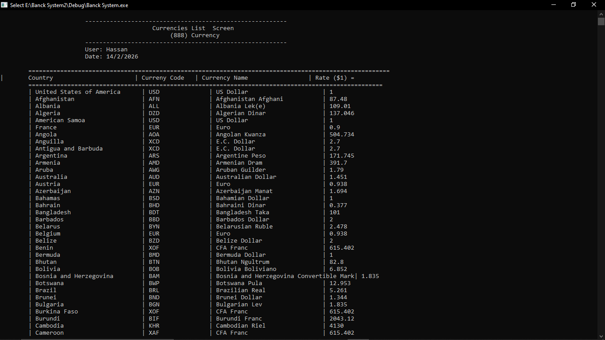 |

📂 View More Screens (Update/Delete/Find)

- **Update Operations:** - 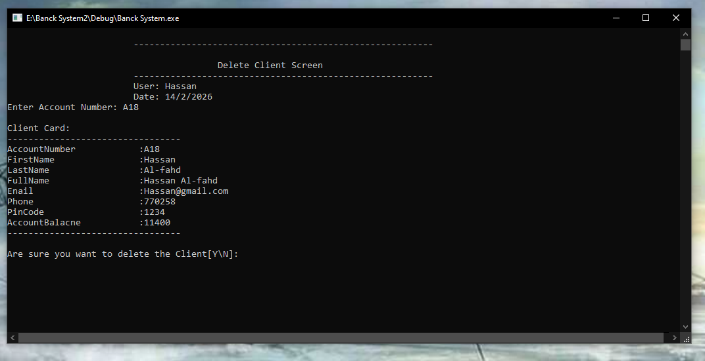
  - 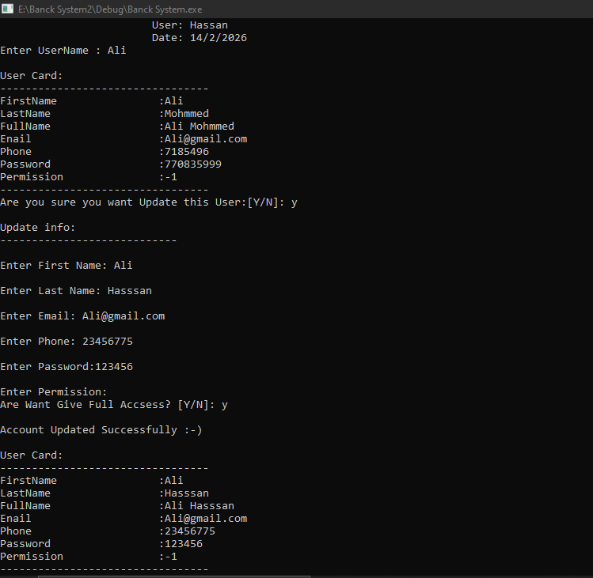
  - 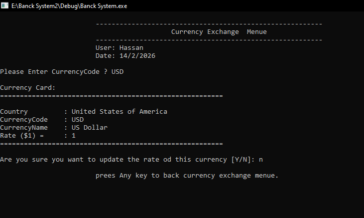
- **Delete Operations:** - 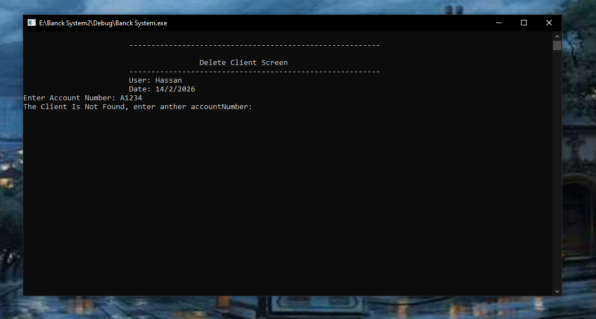
  - 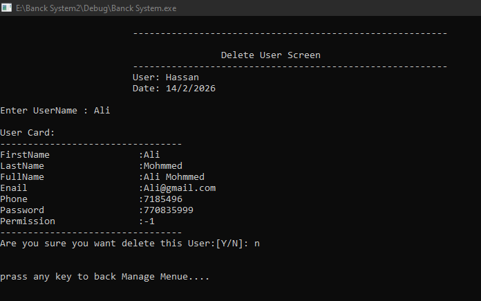
- **Search Operations:** - 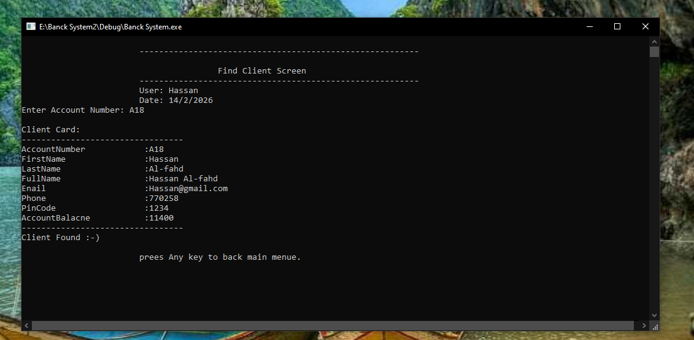
  - 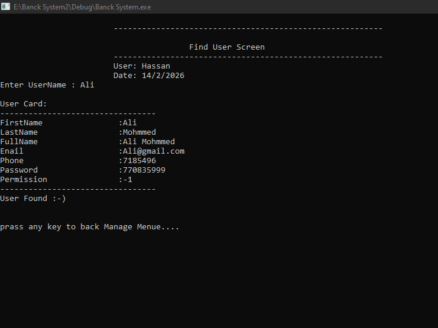
  - 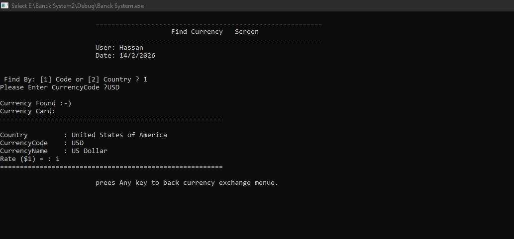
- **Balances & Financials:** - 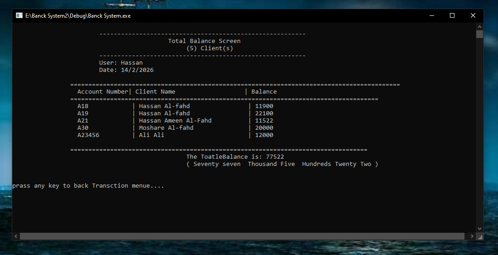
  - 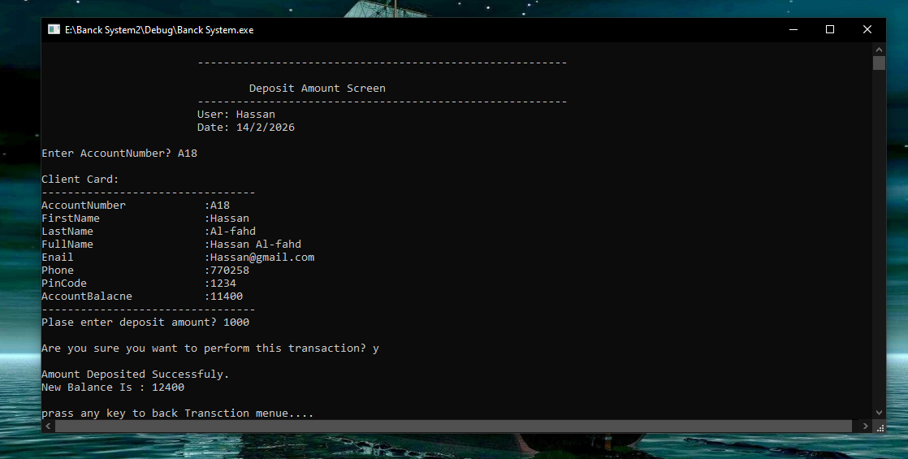
  - 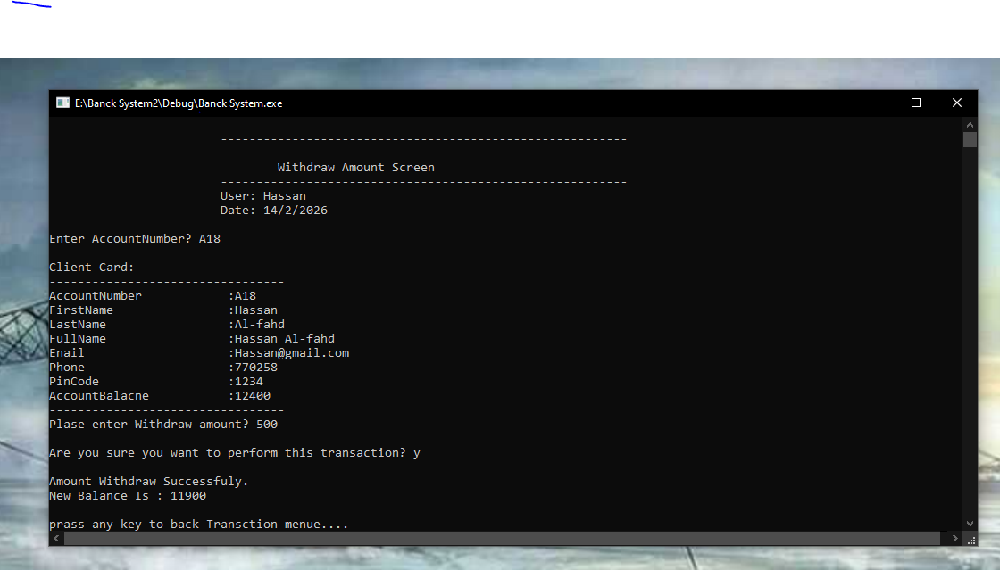

---
